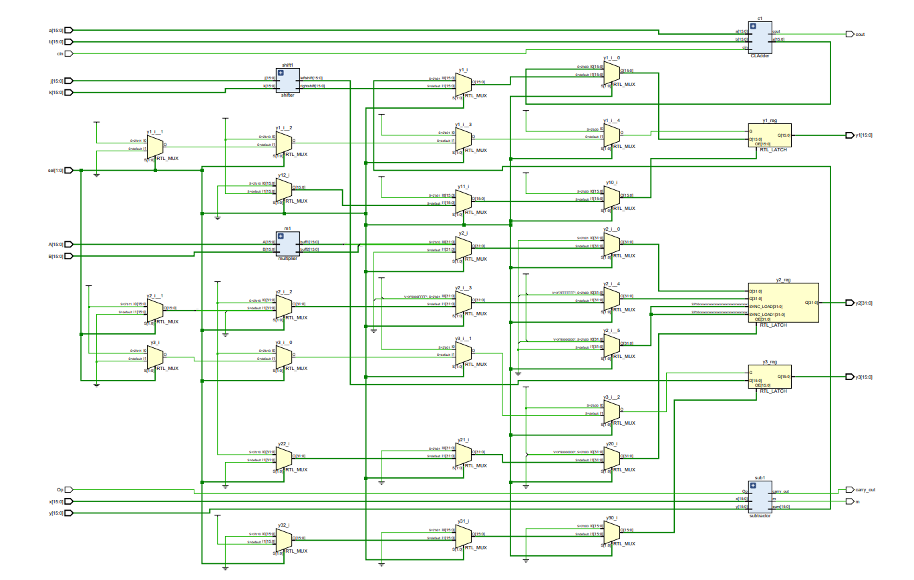

# 16bit-ALU-design
* Design of a 16-bit ALU using verilog.
* Done as a part of the coursework, Advanced Digital System design using Verilog HDL (18EC43)
* A top-down design approach was followed with ALUDesign being the top-level module/bock. 
* Further subdivided into sub-blocks/modules - adder, subtractor, multiplier, shifter - until we hit the leaf cells which cannot be further subdivided. 

